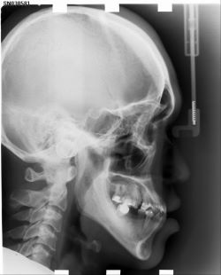
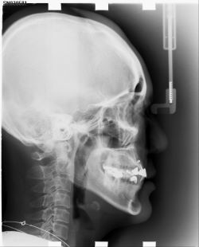
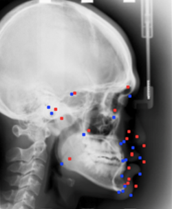
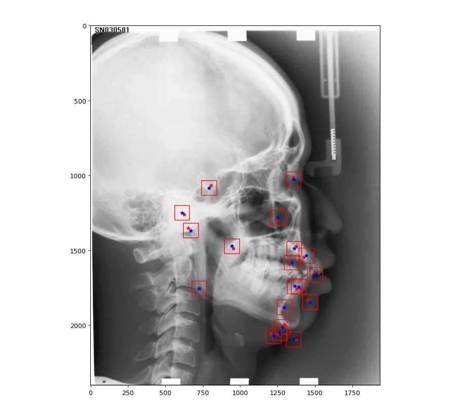

# Cephalometric analysis 

## A computer vision based project to locate landmarks on X-Ray images that helps in dental and facial analysis.  

### Methods :
*  Zernike Moment
* Procrustes Analysis
* Template Matching

Each of these methods playes a role in the final output of the system.

### Zernike Moment:
This algorithm is used to reduce any image to a much smaller version that contain the most relevant information of this image. 
We used it to extract the 5% most similar images from the training data to the test image that we want to locate the landmarks in it.

### Procrustes Analysis 
This algorithm is used to allign different shapes on each other, which in our case are the landmark position of the 5% training images that we chose earlier.
This is used to make sure that any variation in the scull position, orientation or size are taken into consideration like these 2 images where we can clearly see different positions and orientations of the nose for example.    

   

we used this algorithm to calculate a mean shape representing the initial approximation location of each landmark where we are going to assume that around this spot we know that the true landmark is present and this is what we call Expectation window. 
This can be seen in the following picture as the blue markers are the ground truth of the landmark positions and the red ones are the initial approximation location. 

### Template Matching  
This algorithm is used after obtaining what is so called template for each landmark; the template is simply a small window around the exact location of the landmark that represents the charactarestics of this landmark.  

Having these landmarks we start applying the template matching where we cross-correlate the template with an expectation window of the location of the landmark and the pixel with the maximmum correlation is the landmark location we found.  
 
## Results  

Here are the current final result, the blue markers are the Initial approximation and the red ones are the calculated landmark positions.  

